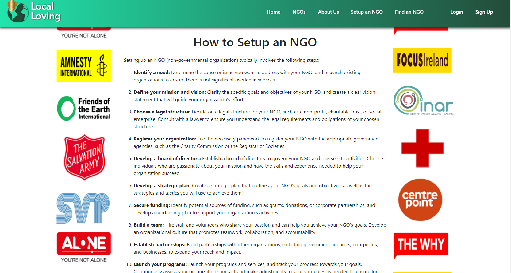

# **A Dubug Cause** : *Hackathon Feb 2023*


## Project Overview
A website informing users of fundrasing and charity events in their local community, as well as providing general information about NGOs, fundraising and charities.

### Deployed link
Visit the site [here](https://hack-team-9.herokuapp.com/)


## Planning
### **Agile Methodologies** 
We set up a project and used the kanban board to organise and coordinate tasks.

[Project Board](https://github.com/users/SamMartin92/projects/3/views/1?layout=board)

## User Stories 

1. As a user, I want to land on a homepage that gives me a description of what the site offers and navigaiton.

**Aceptance criteria**:
- The homepage features a moving collage of NGO and charity related images as well as a short sentence describing the goal of the site. 


- It also features a nav bar which allows user to navigate to other pages like the "About Us" page is they want more information about the site.
- The Navbar for visiting users that are not logged in displays a Login and Sign Up link.


-For logged in users the navbar gives access to the add Ngo page and a logout link


 
2. As a user I want to be able to view blog posts about NGOs and local charities.

   **Acceptance criteria**: NGO Page
   
  

3. As a user, I want to be able to register an account so that I can post about my fundraising or charity event.
   **Acceptance criteria**:  A Sign-up and Login page allows user to register an account.


4. As a user, I want to post about an event I am hosting in order to spread awareness in my community

   **Acceptance criteria**: NGO Page

5. As a user I want to know more about how NGOs function and how to get involved.

   **Acceptance criteria** : 
   - The site features blog posts and search features for users to learn more.
   

   -There is also a "How to Set Up an NGO" page for users.

   

6. As a user I want to find NGOs based on a specific clause which is important to me.

  **Acceptance criteria** :
  - The site features a 'Find an NGO' page.
  - Here, users can search for NGOs based on their selected cause and it will present them with a number of NGOs which support it.
  - This is generated using an API from every.org

 
 
## APIs:

- In this project, an API from [every.org](https://www.every.org/) was used for the Find An NGO page.
- This API allows users to find an API based on the cause they select. 

## Wireframes:
Wireframes were designed by [Ant](https://github.com/Ant2210) created using figma.

  * [Desktop wireframes](static/readme/wireframes_desktop.png)
  * [Sign-up/Login pages](static/readme/wireframes_signup_login%20pages.png)
  * [Tablet view](static/readme/wireframes-tablet.png)
  * [Mobile view](static/readme/wireframes_mobile.png)


## Testing

### **Automation Testing**

- Automated testing was conducted on the urls.py file.
- A test was conducted on the response of each url and passed. See screenshot below:


- Encountered a postgres error
  which did not allow us to progress with any further testing within the timeframe allowable for the hackathon so manual testing was employed instead for th rest of the project. Error below
  
  

## Deployment

- This site was developed in [Gitpod](https://www.gitpod.io/) and deployed to [Heroku](https://www.heroku.com/)
- It was built using the Django framework.
- The site was developed by previewing the site in the browser through Port 8000 in Gitpod by running the command ```python manage.py runserver``` in the terminal. Changes and entries to the workspace were then committed and pushed to this Github repository.
### Setting up the project in Gitpod workspace:
1. Install django by running the following command ```pip3 install Django```
2. Install gunicorn for running the deployed website ```pip3 install gunicorn```
3. To install postgres to support the database ```pip3 install dj_database_url pyscopg2```
4. Install any other required libraries by running similar commands and add them to a requirements.txt file so that Heroku will install them at deployment. This is done by running ```pip3 freeze --local > requirements``` in the terminal and can be run again when necessary to add further libraries.
5. Create your Django project by entering the following command: ```django-admin startproject < YOUR PROJECT NAME >```
6. To create a django app, run ```python manage.py startapp < YOUR APP NAME >```
7. Add the name of the newly created app to "INSTALLED_APPS" in settings.py.
8. Development of apps can begin from here.
### Deploying to Heroku
1. Once logged into Heroku, choose the option 'Create App'.
2. Attach the database in the Resources tab in Add-ons. Search for 'Heroku Postgres' and add.
3. In your workspace, create an env.py file which will store environment variable and add it to .gitignore so as not to expose any sensitive information publicly in Github.
4. Store your 'SECRET_KEY' and 'DATABASE_URL' here and import into settings.py
5. In Heroku, under settings, choose 'Reveal Config Vars and add your 'SECRET_KEY' and 'DATABASE_URL'.
6. Migrate to the database in Gitpod using ```python manage.py makemigrations``` followed by ```python manage.py migrate```
7. Add your Heroku app URL to "ALLOWED_HOSTS" in settings.py.
8. Create a Procfile in the top level of the directory and add ```web: gunicorn projectname.wsgi``` so Heroku knows how to run the project.
### Initial deployment:
1. Push any changes to Github after connecting your Heroku app to your repository.
2. Add DISABLE_COLLECTSTATIC with a value of 1 to Heroku config vars.
3. Select Github in Deployment method and choose 'Deploy branch' under Manual Deploy, ensuring your main branch is chosen.
4.  Remove DISABLE_COLLECTSTATIC config var.
5. Change DEBUG to False in settings.py
6. Push changes and deploy.

## Technologies used

- [HTML5](https://en.wikipedia.org/wiki/HTML5) for the contents and structure of the website.
- [CSS3](https://en.wikipedia.org/wiki/CSS) for the styling and animations.
- [Python](https://en.wikipedia.org/wiki/python_(programming_language)) for the backend with Django
- [Django](https://en.wikipedia.org/wiki/Django_(web_framework)) as the framework for the website.
- [Bootstrap](https://getbootstrap.com/) for the layout of the site.
- [Figma](https://www.figma.com) for the wireframes.
- [Allauth](https://django-allauth.readthedocs.io/en/latest/) for site authorisation.
- [amiresponse]() to demonstrate website responsiveness


## Credits
* Logo and image design was done by [Mia Rasmussen](https://github.com/MiaRasmussen05)
Project idea took inspiration from the following sources:
* []() 


## Contributors

* [Carmen Cantudo](https://github.com/CarmenCantudo)
* [Sam](https://github.com/SamMartin92)
* [Mia Rasmussen](https://github.com/MiaRasmussen05)
* [Ivette McDermott](https://github.com/ivettemcdermott)
* [Hannah Carey](https://github.com/HPCarey)
* [Ant](https://github.com/Ant2210)
* [Raymond](https://github.com/RVKIonesi)


## Acknowledgements

To all the developers who worked on this project, your time and contributions are highly valued. Thank you.
To our Facilitator- Kenan Wright, thank you for your support.
